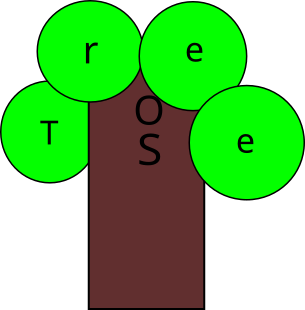

0111 48 45 4C 4C 4F 57 4F 52 4C 44
(it says HELLO WORLD in binary and hex)

#hello guys, im Ali Kerem...

0111 48 45 4C 4C 4F 57 4F 52 4C 44
(it says HELLO WORLD in binary and hex)

i use %20 of ai for bootloader (gpu drivers cancelled because i banned claude :( )  sorry guys

#hello guys, im Ali Kerem My dream is to complete the Alpha stage of Tree OS and then move on to the beta and subsequent phases; I’ll keep going, driven by the joy of creating a recognized operating system. As I mentioned, Tree OS is currently the work of a 12-year old kid (its me xd). Unfortunately, it isn't in a working state right now, but if I build a team, the project could move much faster; after all, there is strength in unity. (I suppose I’m open to your requests at any time.) Also, there might be some errors in the text, as I used a translation app for it.
